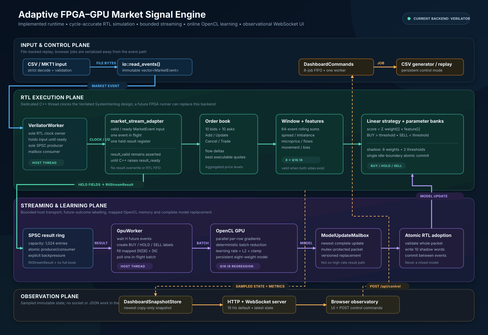

# Adaptive FPGA–GPU Market Signal Engine

This project is a market-signal research prototype. C++ reads market events,
SystemVerilog RTL maintains an order book and calculates features, and an
OpenCL GPU learner fine-tunes a model which RTL can atomically adopt.

The RTL currently runs through **Verilator simulation**, not a physical FPGA.
The C++ reference/replay model is test support, not the normal live path.

## System overview



The diagram is deliberately split into three boundaries:

| Boundary | What crosses it | Why it exists |
| --- | --- | --- |
| Market data → RTL | `MarketEvent` | Gives the order book its raw event stream. |
| RTL → GPU | `RtlStreamResult` through the SPSC ring | Lets RTL produce results without waiting for GPU work. |
| GPU → RTL | complete `ModelUpdate` through the mailbox | Prevents partial or unsafe model updates. |

### The important idea

The project is not “GPU calls FPGA” or “RTL calls GPU.” They cannot safely
share memory or call one another. C++ is a thin coordinator around two separate
workers:

```text
VerilatorWorker thread: clocks RTL and produces results.
GpuWorker thread:       consumes results, labels/trains, publishes updates.
```

The SPSC ring is the one-way high-speed path from RTL to GPU. The mailbox is
the one-way latest-model path from GPU back to RTL. This makes ownership clear
and avoids corrupting data while another worker is using it.

RTL and GPU code never call each other directly. C++ owns the ring, mailbox,
validation, and shutdown between them.

## Read the system by data path

- [CSV / binary data into RTL](docs/csv_to_rtl.md)
- [RTL results into the GPU](docs/rtl_to_gpu.md)
- [GPU model updates back into RTL](docs/gpu_to_rtl.md)
- [GPU learner: model, inputs, labels, and outputs](docs/gpu_model.md)
- [Order book behaviour](docs/order_book.md)
- [Test suite and commands](docs/test_suite.md)
- [Event format and fixed-point rules](docs/protocol.md)
- [C++ reference-model semantics](docs/reference_model.md)

## What the model is trying to learn

At one event, the model sees eight order-book-derived features. It cannot know
the answer yet, so the GPU worker waits `labelHorizonEvents` future events and
asks a practical question:

```text
Would buying at the old best ask, then selling at the later best bid,
have cleared the minimum profit?
```

The mirrored question creates SELL labels. If neither trade would have made
enough, the label is HOLD. The GPU trains a small linear model on these answers
and returns the full set of weights and thresholds. Read the detailed
[GPU model guide](docs/gpu_model.md).

## Current status

- The normal path is CSV → RTL → SPSC → GPU → mailbox → RTL.
- The first GPU learner is implemented as Q16.16 linear SGD.
- GPU execution is unverified on this WSL machine because it has no selectable
  OpenCL GPU; verify it on the RTX 4060 machine.
- `featureBatchSize` is the GPU batch size `N`; `labelHorizonEvents` is the
  future look-ahead distance.

### What is intentionally not claimed yet

- A physical FPGA board is not connected; RTL is being simulated by Verilator.
- GPU learning has not been executed on this WSL machine because no usable GPU
  is available here.
- The first learner is a simple, understandable baseline. It is not yet a
  highly parallel RTX-optimised learner or a proven profitable trading system.

## Build and run

```bash
./scripts/build.sh
./scripts/run_tests.sh
./build/market_engine_demo --input data/events.csv
```

On the RTX/OpenCL machine, use enough valid events for one labelled batch:

```bash
./build/market_engine_demo \
  --input data/events.csv \
  --gpu-feature-upload \
  --batch-size 1024
```

The existing `--gpu-feature-upload` command name now starts the full streaming
GPU learner, not merely a copy test.

## Observational dashboard

Run without an input file to keep the localhost control dashboard open:

```bash
./build/market_engine_demo
# open http://127.0.0.1:8080/
```

The browser can generate deterministic CSV data and enqueue replay runs. During
a run it shows sampled events, the book, all eight fixed-point features, the
signal, active model, GPU metrics, queue pressure, and latency. A normal
`--input` run serves the same dashboard only for that run's lifetime.

The server binds `127.0.0.1` by default. Set `dashboardBindAddress` explicitly
in the JSON configuration to expose it on another interface. `--no-dashboard`
creates neither the server thread nor the snapshot publisher. To quantify the
local observation cost:

```bash
./scripts/benchmark_dashboard.sh build
```
