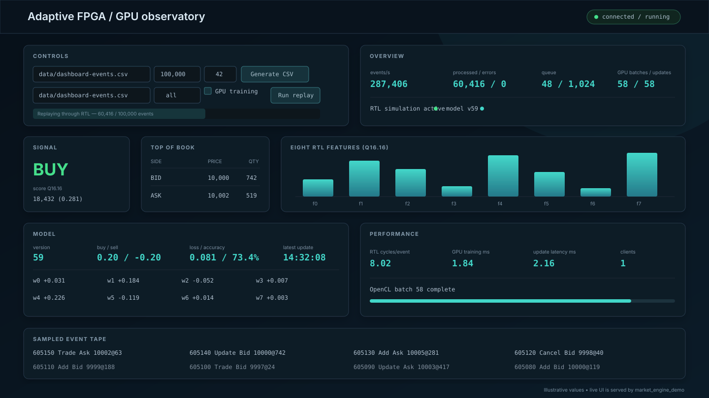

# Adaptive FPGA–GPU Market Signal Engine

An end-to-end market-signal research platform that combines a cycle-accurate
SystemVerilog pipeline, a C++20 streaming runtime, online OpenCL training, and a
real-time browser dashboard.

> [!IMPORTANT]
> The RTL currently runs as a **Verilator simulation**. The interfaces are
> hardware-oriented, but this repository does not yet connect to a physical
> FPGA. It is a research and verification system, not a production trading
> platform or a claim of profitability.


## What the system does

Each decoded market event passes through a ten-level RTL order book. The RTL
maintains a 64-event rolling window, produces eight signed Q16.16 features, and
scores them with an atomically replaceable linear model. A dedicated host
worker moves compact RTL results into a bounded SPSC ring. When GPU mode is
enabled, a second worker creates future-outcome labels, trains the model in
OpenCL batches, and sends complete model replacements back to the RTL through
a latest-value mailbox.

The browser dashboard observes that path without being placed in the
per-event hot loop. It can also queue deterministic CSV generation and replay
jobs while the application is running in control mode.



## Core capabilities

| Area | Implemented capability |
| --- | --- |
| Market data | Strict CSV and explicit little-endian `MKT1` readers; deterministic CSV generator |
| RTL pipeline | Valid/ready input, ten levels per side, Add/Update/Cancel/Trade, rolling features, linear BUY/HOLD/SELL strategy |
| Streaming | Dedicated Verilator thread, one-result RTL holding register, 1,024-entry host SPSC ring, bounded backpressure |
| GPU training | OpenCL device selection, mapped `[N][8]` features and `[N]` labels, data-parallel row gradients, deterministic batch reduction |
| Model deployment | Versioned full-model packet, latest-value mailbox, ten-word shadow bank, event-boundary atomic commit |
| UI and telemetry | Embedded HTTP server, read-only WebSocket snapshots, replay controls, order book, features, model, loss/accuracy and latency |
| Verification | C++ unit tests, SystemVerilog tests, RTL/C++ differential replay, GPU tests that skip clearly when no GPU exists |

## Quick start

### Prerequisites

- Ubuntu 22.04 or newer
- CMake 3.22+
- A C++20 compiler
- Boost.System 1.74+
- Verilator
- OpenCL headers and loader; a GPU OpenCL runtime is required only for GPU mode
- Python 3 for the standalone event generator

On a Debian/Ubuntu host, package names typically include `build-essential`,
`cmake`, `libboost-system-dev`, `verilator`, `ocl-icd-opencl-dev`, and
`python3`. CMake downloads pinned revisions of Catch2 and nlohmann/json on the
first configure.

```bash
./scripts/build.sh
./scripts/run_tests.sh
```

Start the dashboard in persistent control mode:

```bash
./build/market_engine_demo
# open http://127.0.0.1:8080/
```

Or generate input and run a finite RTL replay:

```bash
python3 python/generate_events.py --output data/events.csv --events 100000 --seed 42
./build/market_engine_demo --input data/events.csv
```

Enable the adaptive GPU path after confirming that an OpenCL GPU is available:

```bash
./build/market_engine_demo --list-opencl-devices
./build/market_engine_demo --gpu-smoke-test
./build/market_engine_demo \
  --input data/events.csv \
  --gpu-feature-upload \
  --batch-size 1024 \
  --model-autosave data/latest-model.json
```

The historical option name `--gpu-feature-upload` enables the complete online
training worker, not only an upload benchmark. A full default batch needs more
than `labelHorizonEvents + featureBatchSize` valid results (more than 1,124
with the supplied configuration).

## Runtime data flow

```text
CSV / MKT1
   │  MarketEvent
   ▼
C++ EventReader ── immutable event span ──► VerilatorWorker thread
                                               │ clocks
                                               ▼
                                    SystemVerilog market pipeline
                                    book → window → features → score
                                               │ RtlStreamResult
                                               ▼
                                      SPSC ring (capacity 1,024)
                                               │
                                               ▼
                                          GpuWorker thread
                                    horizon labels → mapped batch
                                               │ [N][8] + [N]
                                               ▼
                                           OpenCL GPU
                                    row gradients → batch update
                                               │ complete ModelUpdate
                                               ▼
                                      latest-value mailbox
                                               │
                                               └────► RTL shadow bank + commit
```

There is no direct RTL-to-GPU call and no shared mutable model. C++ owns both
transport boundaries. If GPU mode is disabled, the main thread drains the SPSC
ring so RTL can continue without constructing training batches.

## Dashboard

The dashboard is intentionally observational:

- `GET /` serves the embedded single-page UI;
- `GET /health` returns a small liveness response;
- `GET /ws` upgrades to a WebSocket and streams the newest immutable snapshot;
- `POST /api/control` queues `generate` or `run` commands in persistent control
  mode.

Snapshots are sampled from the RTL path every 256 published results and are
published to clients at `dashboardUpdateHz` (10 Hz by default). Socket I/O,
JSON serialization, and browser speed therefore do not sit in the event loop.
See the [dashboard and telemetry guide](docs/dashboard.md).

## Documentation

| Guide | Scope |
| --- | --- |
| [Architecture](docs/architecture.md) | Processes, threads, hardware boundary, ownership, backpressure and lifecycle |
| [Dashboard and WebSockets](docs/dashboard.md) | UI, HTTP endpoints, snapshot schema, controls and security boundary |
| [Running the system](docs/operations.md) | Build, data generation, CPU/RTL replay, GPU mode, models and troubleshooting |
| [Configuration reference](docs/configuration.md) | JSON fields, CLI overrides, defaults and current implementation status |
| [CSV/MKT1 to RTL](docs/csv_to_rtl.md) | File parsing, immutable backlog and RTL valid/ready handshake |
| [RTL to GPU](docs/rtl_to_gpu.md) | Held register, SPSC ownership, horizon labels and mapped OpenCL batches |
| [GPU learner](docs/gpu_model.md) | Fixed-point regression, kernel stages, metrics and limitations |
| [GPU to RTL](docs/gpu_to_rtl.md) | Model validation, mailbox semantics and atomic parameter commit |
| [Protocol](docs/protocol.md) | Event encodings, binary layout and Q16.16 numerical rules |
| [Order book](docs/order_book.md) | Book mutation and invariant semantics |
| [Test suite](docs/test_suite.md) | Test layers and hardware-dependent checks |
| [Development](docs/development.md) | Toolchain checks and repository layout |
| [Reference model](docs/reference_model.md) | Independent C++ semantics used by verification |

## Current limitations

- Verilator is the operational RTL backend; there is no PCIe/DMA or physical
  FPGA integration yet.
- Training is a compact linear regression baseline, not a neural network.
- Labels use future top-of-book quotes and ignore fees, slippage, queue
  position, fill probability and market impact.
- Thresholds are currently retained from the active/configured model; the GPU
  updates the eight weights.
- A partial final batch is discarded, and the last horizon-sized tail cannot
  be labelled because no future observation exists.
- The dashboard has no authentication or TLS. Keep the default loopback bind
  unless it is placed behind an appropriate trusted proxy.
- GPU execution depends on the host's OpenCL runtime. Tests report a skip,
  rather than success, when no selectable GPU is present.

## Project status

The complete simulated feedback loop is implemented and covered by unit,
integration, RTL, and differential tests. GPU behavior must still be verified
on each target driver/device combination. Performance numbers from Verilator
are host-simulation throughput and must not be interpreted as synthesized FPGA
clock rates.

## License

No license file is currently included. Treat the source as all rights reserved
until the project owner adds an explicit license.
