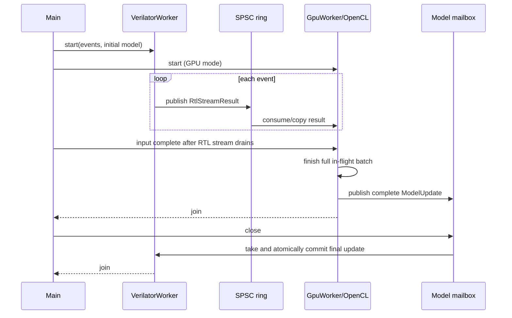

# Architecture

This document describes the system that is implemented in this repository.
The current hardware execution boundary is a Verilated SystemVerilog model;
the host interfaces are deliberately shaped so a future physical-FPGA runner
can replace it without changing the GPU model-update contract.


## Runtime boundaries

The application separates four concerns:

| Boundary | Owner | Data crossing it | Synchronisation |
| --- | --- | --- | --- |
| Event source → RTL worker | Main/control worker owns the immutable event vector | `market::MarketEvent` | RTL `valid/ready`; no additional input queue |
| RTL → host transport | `VerilatorWorker` produces; GPU worker or main thread consumes | `verilator::RtlStreamResult` | One-result RTL register plus host SPSC ring |
| GPU → RTL transport | `GpuWorker` publishes; `VerilatorWorker` consumes | Complete `gpu::ModelUpdate` | Mutex-protected latest-value mailbox |
| Runtime → dashboard | Coordinator publishes; web sessions read | Copy-only `DashboardSnapshot` | Shared immutable snapshot pointer |

The RTL and GPU never call each other. The host coordinator owns the worker
lifecycle, queueing, validation, shutdown, and failure propagation.

## Components

### Input and command plane

`io::read_events()` validates an entire CSV or MKT1 file and returns a
`std::vector<MarketEvent>`. `LiveCoordinator` passes an immutable span over the
selected prefix to `VerilatorWorker`; that vector is the input backlog.

When the binary is started without `--input`, `DashboardCommands` adds a
separate command thread and an eight-entry command queue. Browser requests can
generate deterministic CSV data or load and replay a file. These commands are
not injected into an already-running replay.

### RTL worker and Verilator boundary

`VerilatorWorker` is the only owner of `VerilatorRunner` and therefore the only
thread that advances simulated time. The runner drives `in_valid`, observes
`in_ready`, toggles the clock, decodes outputs, and writes complete models into
the RTL parameter interface.

`market_stream_adapter` wraps the core pipeline with one held result register.
It permits one input event in flight and will not accept another event while a
completed result is waiting. This makes the relationship strictly one input to
one compact result, including error results.

Inside `market_pipeline`:

1. `order_book` maintains ten aggregated bid and ask levels.
2. `feature_window` retains 64 event contributions for order flow, trade flow,
   and absolute midpoint movement.
3. `feature_engine` derives eight Q16.16 values.
4. `strategy_model` calculates a saturated linear score and compares it with
   strict BUY and SELL thresholds.

The configured `clockPeriodNs` advances Verilator's simulated timestamp. It is
not a statement about host throughput or synthesized timing.

### RTL-to-GPU transport

The RTL adapter first holds a result until the C++ worker asserts
`result_ready`. The worker reserves an SPSC slot, decodes directly into it,
clocks the acceptance handshake, then publishes the slot. The ring capacity is
1,024 results.

If the ring is full, `result_ready` remains low. That fills the one-result RTL
register, which lowers RTL input readiness. No result is overwritten. A
continuously full ring eventually raises the worker's backpressure-timeout
error rather than hanging indefinitely.

In GPU mode, `GpuWorker` is the only ring consumer. In non-GPU mode, the main
thread drains results and records the first book error. The SPSC transport
therefore always has exactly one producer and one consumer.

### Labels and GPU training

The GPU worker retains prior results until a future result is at least
`labelHorizonEvents` newer. It uses executable quote directions:

```text
long profit  = future best bid - old best ask
short profit = old best bid - future best ask

BUY  when long profit  >= 1 tick and long profit  > short profit
SELL when short profit >= 1 tick and short profit > long profit
HOLD otherwise
```

Rows with invalid features or a missing/empty top of book at either endpoint
are discarded. The eight features and one label are written directly into
mapped OpenCL buffers. Once `featureBatchSize` rows exist, the buffers are
unmapped and training starts.

The GPU runs two kernels:

1. `regression_row_gradients` launches one work item per row and produces eight
   gradients, squared error, and classification correctness.
2. `regression_apply_batch` launches eight work items, reduces each weight's
   row gradients in deterministic row order, applies Q16.16 learning rate and
   L2 regularisation, and clamps weights to ±32.0.

Only one training batch is in flight. While it is running, this implementation
polls for completion and does not consume more ring entries. Backpressure is
therefore intentional and observable under slow GPU workloads.

### Model return and atomic adoption

GPU model state persists between batches. A completed readback contains all
eight weights, both thresholds, and a monotonically assigned update version.
`ModelUpdateMailbox` retains the newest complete packet.

At an idle event boundary, `VerilatorWorker` takes an update, validates its
version and thresholds, then writes ten values into the RTL shadow bank. A
single commit copies the whole bank into the active strategy registers. A
signal can therefore use either the old model or the new model, never a mixture
of the two.

The worker remains alive after the last event until the GPU drains the ring,
finishes any full batch, publishes its last update, and closes the mailbox.

## Concurrency and ownership

```text
main thread
├─ owns loaded events, coordinator lifetime and non-GPU ring drain
├─ starts/joins VerilatorWorker and optional GpuWorker threads
└─ may own DashboardServer

VerilatorWorker thread
├─ sole VerilatorRunner / RTL clock owner
├─ sole SPSC producer
└─ sole model-mailbox consumer

GpuWorker thread (GPU mode)
├─ sole SPSC consumer
├─ sole GpuModel / OpenCL command producer during replay
└─ sole model-mailbox producer

dashboard I/O thread
├─ HTTP accept/session handling
└─ reads newest immutable snapshot; never touches RTL/OpenCL handles

dashboard command thread (control mode only)
└─ serially executes queued generation and replay jobs
```

## Observation path

The RTL worker invokes its observation callback once per 256 published results
and once at completion. The callback copies the current book, features, signal,
model and selected counters. A publisher thread updates the immutable snapshot
at `dashboardUpdateHz`. Each WebSocket session independently reads the newest
snapshot and keeps no unbounded outgoing queue.

This is a lossy telemetry design by intent: slow clients miss intermediate
states but cannot slow the market-data path by accumulating messages.

## Startup and shutdown sequence



On a GPU exception, the GPU worker requests RTL shutdown. RTL exceptions cause
the coordinator to stop or drain the other side and rethrow the original
failure after joining threads.

## Performance interpretation

- `events/s` is end-to-end host replay throughput.
- `RTL cycles/event` is the number of simulated RTL cycles divided by accepted
  events.
- upload, kernel and readback timing comes from OpenCL profiling events.
- model-update latency spans submission through completed readback.
- SPSC occupancy exposes consumer pressure, not FPGA BRAM usage.

Dashboard benchmarking is available through
`./scripts/benchmark_dashboard.sh build`. Always report the host CPU, GPU,
driver, build type, event count and dashboard mode with performance results.

## Deliberate non-claims

- The current transport is host memory, not PCIe DMA.
- The C++ reference model is test support and is not executed in the normal
  live path.
- GPU labels are retrospective training targets, not ground-truth fills.
- Verilator throughput is not physical-FPGA throughput.
- No component submits real orders.
